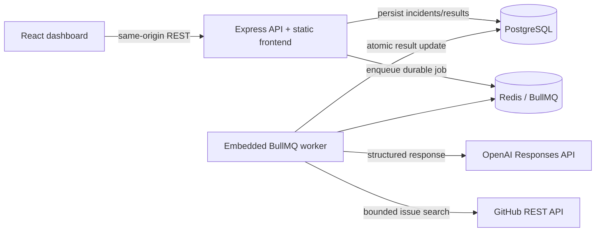

# AI Incident Intelligence Platform

A production-packaged incident operations dashboard that turns a plain-language
IT incident into structured severity and category classification, a probable
root cause, actionable troubleshooting steps, and relevant public GitHub issue
context. Analysis runs asynchronously through a durable Redis-backed queue so
the API stays responsive while the AI workflow completes.

**Project status:** M1–M6.1 complete and running in production on Railway.

## Recruiter summary

A production-oriented full-stack incident-analysis system demonstrating backend architecture, durable asynchronous processing, structured AI integration, relational persistence, external API enrichment, testing, CI, Docker, and deployment.

**Best evidence:** responsive REST API, PostgreSQL/Prisma data model, Redis/BullMQ retries and recovery, schema-validated OpenAI output, bounded GitHub enrichment, health checks, security controls, and production deployment.

> **Live demo:** [SignalDesk Incident Intelligence](https://ai-incident-intelligence-production-df73.up.railway.app)
>
> The production deployment uses managed Railway PostgreSQL and Redis services,
> an embedded BullMQ worker, OpenAI structured analysis, and GitHub issue context.

## Architecture



The deployable artifact is one Node container containing the Express API,
production React build, and embedded BullMQ worker. PostgreSQL and Redis remain
managed dependencies. This intentionally small architecture is appropriate for
a portfolio deployment and can later split the worker into a dedicated service
without changing the queue contract.

## What it demonstrates

- React 19, TypeScript, Vite, responsive and accessible SaaS UI
- Express 5 REST API with Zod validation and Prisma persistence
- OpenAI Responses API structured output with a strict schema
- BullMQ retries with exponential backoff and restart recovery
- Bounded, non-fatal GitHub issue enrichment
- PostgreSQL- and Redis-aware readiness checks
- Multi-stage, non-root production Docker image
- GitHub Actions CI plus Railway and Render infrastructure-as-code
- Security headers, body limits, rate limiting, safe errors, and graceful shutdown

## Analysis workflow

1. `POST /api/incidents` validates and atomically persists the incident and job.
2. BullMQ receives a deterministic job ID, with three attempts and exponential
   backoff. Incomplete database jobs are reconciled back into Redis on startup.
3. The worker performs one bounded GitHub issue search. Lookup failure is
   non-fatal and analysis continues using the incident report alone.
4. `gpt-5-mini` returns schema-validated severity, category, root cause, and
   ordered troubleshooting steps.
5. Prisma atomically records the completed analysis. The frontend polls every
   2.5 seconds only while the job is `QUEUED` or `PROCESSING`.

## Local development

Prerequisites: Node.js 24+, npm, and Docker Desktop.

```bash
npm ci
docker compose up -d
cp backend/.env.example backend/.env
# Add a spend-limited OPENAI_API_KEY to backend/.env.
npm run prisma:generate -w backend
npm run prisma:dev -w backend
npm run dev
```

In a second terminal:

```bash
npm run dev:frontend
```

- Dashboard: `http://localhost:5173`
- API: `http://localhost:3001`
- Liveness: `GET /health/live`
- Readiness: `GET /health/ready` (checks PostgreSQL and Redis)

Vite proxies `/api` and `/health` to the backend. The browser never receives or
calls OpenAI/GitHub credentials. `VITE_API_BASE_URL` is available only when a
separate API origin is intentionally required.

## Verification commands

```bash
npm run lint
npm test
npm run build
npm audit --audit-level=moderate
npm exec -w backend prisma validate
npm exec -w backend prisma migrate status
docker compose config --quiet
docker build --target production -t ai-incident-intelligence .
```

Run the complete local production stack (the app maps to port `3002` so it can
coexist with a development API on `3001`):

```bash
OPENAI_API_KEY=your-spend-limited-key docker compose --profile production up --build
```

Then open `http://localhost:3002`.

## Production configuration

Copy `backend/.env.example` for local use only. Never commit `.env` files.

Required server-side variables:

- `DATABASE_URL` — PostgreSQL connection string
- `REDIS_URL` — Redis-compatible connection string
- `OPENAI_API_KEY` — secret, ideally project-scoped with a hard spend limit

Optional/runtime variables:

- `GITHUB_TOKEN` — raises GitHub search rate limits; remains server-side
- `PORT` — defaults to `3001`; deployment platforms supply the production value
- `FRONTEND_URL` — optional CORS origin for split-origin development/deployments
- `BODY_LIMIT`, `RATE_LIMIT_*`, `STATIC_DIR`, `TRUST_PROXY`

## Deploy to Render

[`render.yaml`](./render.yaml) provisions one Docker web service, private Render
Key Value instance, and Render PostgreSQL database in the same region. It wires
private connection strings automatically, runs Prisma migrations before deploy,
checks `/health/ready`, and waits up to 30 seconds for graceful shutdown.

1. Push this repository to GitHub.
2. In Render, choose **New → Blueprint** and select the repository.
3. Review the paid starter/basic resource plans in the Blueprint.
4. Enter `OPENAI_API_KEY` when prompted; optionally enter `GITHUB_TOKEN`.
5. Apply the Blueprint and wait for the CI-gated Docker deploy.
6. Verify `/health/live`, `/health/ready`, then submit one incident through the
   generated `onrender.com` URL.
7. Add that URL and screenshots to the placeholders at the top of this README.

Render’s Blueprint and health-check behavior are documented in the
[Blueprint specification](https://render.com/docs/blueprint-spec) and
[health-check guide](https://render.com/docs/health-checks).

## Deploy to Railway

[`railway.json`](./railway.json) selects the production Dockerfile, configures
`/health/ready`, and gives shutdowns a 60-second drain. The application keeps a
50-second internal force-exit deadline so `worker.close()` can finish an active
GitHub lookup and OpenAI request before Railway sends `SIGKILL`, while retaining
a 10-second platform buffer.

Provision Railway PostgreSQL and Redis services, then set `DATABASE_URL` and
`REDIS_URL` as reference variables on the application service. Set
`NODE_ENV=production`, `TRUST_PROXY=true`, and a sealed `OPENAI_API_KEY`;
`GITHUB_TOKEN` remains optional. Railway supplies `PORT` automatically.

### Verified production deployment

The live environment consists of three Railway services:

- `ai-incident-intelligence` — same-origin React application, Express API, and
  embedded BullMQ worker
- `ai-incident-db` — managed PostgreSQL persistence
- `Redis` — managed BullMQ queue and retry state

Production verification completed successfully on August 14, 2026:

- Docker build, Prisma pre-deploy migrations, application startup, and
  `/health/ready` completed successfully.
- `/health/live` returned `live`.
- `/health/ready` returned `ready` with PostgreSQL and Redis both `up`.
- The public React application loaded from the same origin as the API.
- A real incident progressed from `PROCESSING` to `COMPLETED` on its first
  analysis attempt.
- OpenAI produced structured severity, category, root-cause, and recovery-step
  output.
- GitHub enrichment returned three relevant public issue references.

The production service uses a 50-second internal graceful-shutdown deadline
inside Railway's 60-second drain window. Secrets remain server-side and are not
returned in API responses or written to application logs.

## CI

`.github/workflows/ci.yml` runs on pushes and pull requests and performs npm
clean install, Prisma generation/validation, backend/frontend lint and tests,
backend/frontend builds, Compose validation, and a production Docker build.

## Milestones

- [x] M1 — API, Prisma, PostgreSQL, Redis scaffold
- [x] M2 — BullMQ job pipeline
- [x] M3 — OpenAI structured incident analysis
- [x] M4 — GitHub external context
- [x] M5 — React submission, status, and results dashboard
- [x] M6 — Production hardening, CI, Docker, deployment, portfolio packaging

No additional milestone or product feature work is included in M6.
